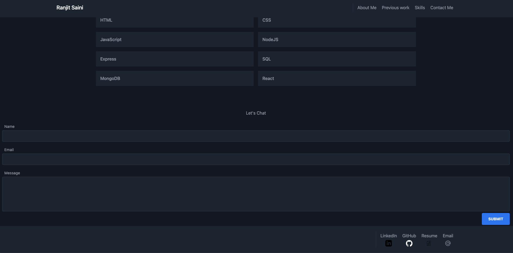

# REACT PORTFOLIO

## Table of Contents

- [Project description](#description)
- [Installation](#installation)
- [Usage](#usage)
- [License](#license)
- [Contribution](#contribution)
- [Questions](#questions)

## Description

This is my very first react project used to create my portfolio, also my first time using tailwind for styling. This will be work in progress as I will be updating it as I learn more about react. Througout the time I spent working on this project, I learend there are numerous free react libraries that I have access to revamp the portfolio. In order to do so, I need to biuld a strong fundamental understanding of React.

## Usage

It can be used for any website or application that has a need of the social networking aspect.

## Installation

N/A

## License

## Contribution

freeCodeCamp - Ideas were used from freeCodeCamp.

## Tests

N/A

## Questions

For additional questions, you can reach me at rsaini88@gmail.com

[Link to Github](https://github.com/rjsaini88)
[Link to repo](https://github.com/rjsaini88/Rj-Saini-Portfolio)
[Link to deployed site](https://main--jazzy-quokka-518630.netlify.app)
